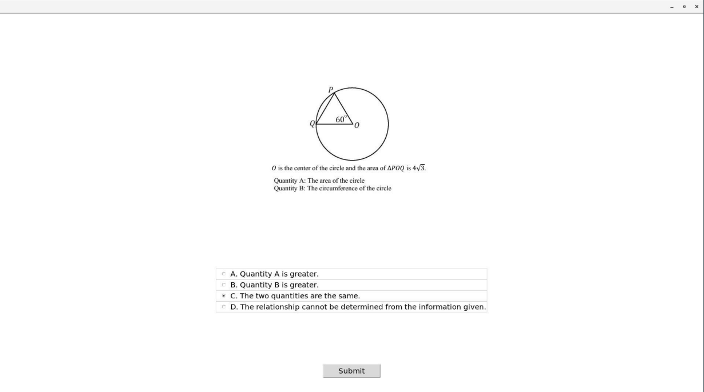

## An EEG-based Approach to Computerized Adaptive Testing
Gabriel Ibagon and Dustin Wright

### Overview
This repository presents a concept for using neural signals as a form of feedback to an adaptive computer interface. The main idea is to allow a computer to change the presentation of a task, based on neural correlates of attention, in order to improve user performance. We explored this idea through the context of a computerized math exam. 

The primary purpose of this repository is to present the concept in order to inspire further thought on neural adaptive interfaces. We included the code used to run our demonstrative experiments, but note that this isn't the most rigorous setup for brain-computer interfacing (more details on the "Thoughts and Discussion" section below). However, feel free to use any part of our code and design if you'd like to expand on these ideas!

### Introduction
Adaptive technologies create a personalized form of human-computer interaction, where an interface changes to meet the needs and abilities of its users. Computerized adaptive testing (CAT) adjusts an exam in order to match the inferred ability of the user. In this work, we ask whether neural signals can be used as a form of input to an adaptive test in order to improve performance. We created a computerized math-based exam that monitors a user's electroencephalogram (EEG) data and presents questions of varying difficulty depending on the user's inferred attention level. The goal of this interface is to increase performance on the exam by allowing the user to attempt questions of greater difficulty when they are most attentive. Our study compared the performance of 10 subjects who took both a statically-ordered exam and an EEG-based adaptive exam. 

### Interface Design

We designed a computerized, multiple-choice math exam that monitored a user's EEG data to adapt the order of question presentation.

While a user is taking the exam, their EEG data is being monitored and analyzed for the presence of neural signals associated with attention state. When a user answers a question, the test then selects the next question to present based on the current attention level. The test employs an algorithm that presents harder questions during periods of high attention, and easier questions during periods of low attention. A screenshot of a sample exam question can be seen here:

### Adaptive Algorithm

A baseline level of attention for the user is obtained based on an average of the first 20 seconds of EEG recording. This allows us to define a threshold for the individual user as 75\% of the user's starting level of attention. We heuristically chose 75\% of the user's initial attention level as an indication that the user was losing attention, and therefore may benefit from the presentation of easier questions. The exam begins with a question of moderate difficulty before employing the algorithm. When a question is answered, we observe the user's current level of attention, and compare this to their attention at the beginning of the question. If the difference of attention level is significant (heuristically chosen as 20 degrees lower) or their absolute level of attention is less than the threshold, we detect that their attention is beginning to wander, and the difficulty of the next question is decremented. Otherwise, it is incremented. This continues until the user has answered all of the questions in the test. A diagram of the algorithm is shown here:

An example recording of attention level over time and the algorithm's selection of question difficulty can be seen here:

### Thoughts and Discussion

Initial experimental results show that the EEG-based computerized adaptive test did not lead to a statistically significant improvement in test scores or in the subject's perception of the tests. There are several possible explanations behind our experimental result, which involve our EEG analysis, adaptive intervention, and experimental design.

One large obstacle that we faced was the reliability of our EEG analysis. A robust and trustworthy EEG system consists of a carefully calibrated headset in a controlled environment. These systems can cost several thousands of dollars and take several hours to consistently calibrate for each user. Because of the time and resource constraints of our project, we chose a cheap and portable system that would allow us to set up and execute our experiment quickly. In the same vein, we employed the headset's proprietary algorithm for attention detection. Although several researchers believe that this algorithm performs usable extraction of attention levels \cite{desa2017personal}, we could not verify or modify the algorithm to make sure that this was the case. With an unreliable measurement of attention, it is difficult to say whether our experiment truly showed that EEG-based measures of attention is an ineffective input for adaptive systems.

Another issue may have stemmed from the assumption that changing the presentation order of a set of question was a good intervention for improving test performance. Traditional CAT selects questions from a large pool based on inferred ability level. The goal of these adaptive tests is to accurately evaluate the test taker. We depart from traditional CAT by restricting the exam to a small set of questions that all test takers will see, and simply changing the order that the questions are presented. Additionally, our goal was to maximize the number of questions answered correctly, instead of trying to accurately evaluate the test-taker. 

Although we are basing our design on previous research connecting EEG measures of attention over a period of time and math performance, it is unclear whether this relationship holds true during such short time lengths (in the question-to-question time scale). Furthermore, our intervention of presenting questions of different difficulty in response to different attention levels might not actually help users perform better. In fact, some may argue that the opposite effect might be true for our intervention - users should be given more difficult questions during periods of low attention in order to challenge them and force them to become more attentive. It seems necessary to perform basic research on the relationship between attention and performance on a fine-grained scale before concluding that this intervention would work.

